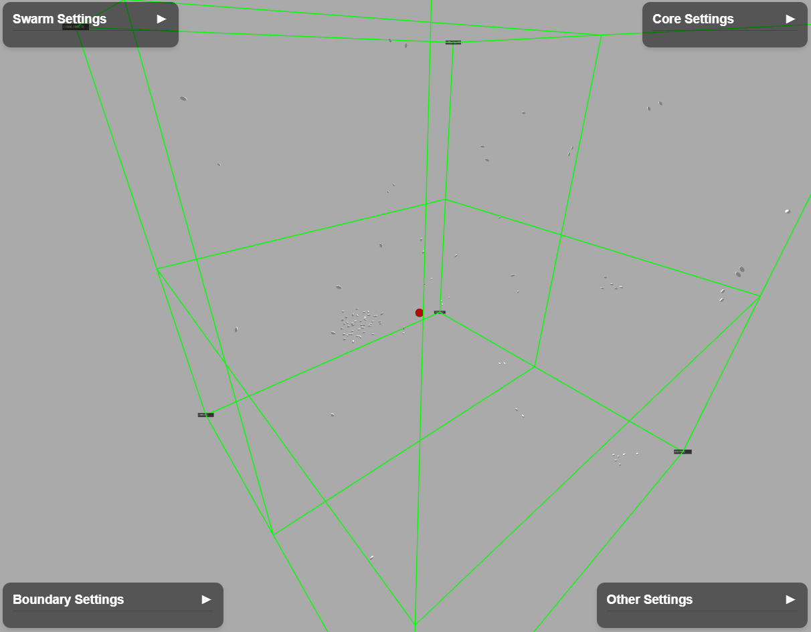

# gyrate-simulation

> A 3D boid simulation built with Three.js that models the collective motion of autonomous agents, inspired by the flocking of birds and schooling of fish. This project was a collaboration with the Gemini AI model.

> 這是一個用 Three.js 開發的 3D 群體行為模擬器，靈感來自鳥群與魚群的集體行動。使用者可調整參數，探索簡單規則如何產生複雜的動態行為。本專案是與 Gemini AI 共同協作完成。

---

## 遊戲預覽 (Preview)

---

## 關於這個專案 (About the Project)

這是一個互動式的 3D 群體行為（Boid Simulation）模擬專案。你可以透過使用者介面，自由調整群體行為的各種參數。

### 主要特色
* **即時參數調整**：自由調整群體的數量、速度、視野範圍，以及影響其行為的三大規則——**分離**、**聚集**和**對齊**。
* **即時互動**：即時觀察參數變化對群體行為的影響。

---

## 如何體驗 (How to Run)

只需點擊以下連結，即可在瀏覽器中直接體驗：

[點擊這裡體驗遊戲](https://jojoey-spec.github.io/gyrate-simulation/)

> **小提醒：** 為了讓此連結生效，請確保你的遊戲檔案已重新命名為 `index.html`，並已在 GitHub Pages 中啟用 `main` 分支。

---

## 使用技術 (Technologies Used)

* **Three.js** - 用於 3D 渲染和場景管理。
* **JavaScript** - 專案的核心程式語言。
* **HTML & CSS** - 用於網頁結構和樣式。

---

## 貢獻者 (Contributors)

* [Jojoey-spec](https://github.com/jojoey-spec)
* **Gemini AI** 模型
